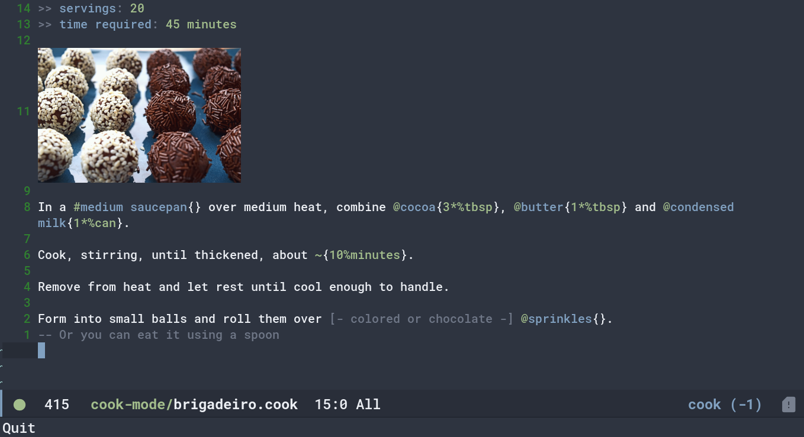

# cook-mode

Basic syntax highlight of cooklang on Emacs

<p align="center"></a></p>
<p align="center">Example of syntax highlight</p>

## Installation 
### For vanilla emacs users
Add the following to your .emacs.el or .emacs.d/init.el
``` emacs-lisp
(load "/path/to/install/directory/cook-mode.el")
```

### For doom emacs user
Add the following to your packages.el 
``` emacs-lisp
(package! cook-mode
  :recipe (:host github 
            :repo "cooklang/cook-mode"))
```


