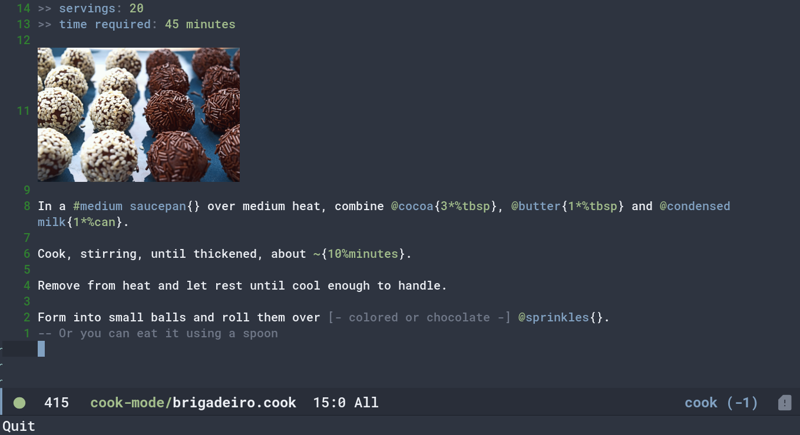

# cook-mode

Emacs support for [cooklang](https://cooklang.org/) recipe files (`.cook`).

The package provides two modes — both are included, and you choose which to use:

|              | `cook-mode`     | `cook-ts-mode`                          |
|--------------+-----------------+-----------------------------------------|
| **Requires** | Any Emacs       | Emacs 29.2+                             |
| **Parsing**  | Regex font-lock | Tree-sitter                             |
| **Extras**   |                 | Imenu, image overlays, YAML frontmatter |


<p align="center"></a></p>
<p align="center">Example of syntax highlight</p>

---

## Installation

### For vanilla Emacs users (package.el)

If you're running Emacs 30 or newer, install with `use-package`:

```emacs-lisp
(use-package cook-mode
  :vc (:url "https://github.com/cooklang/cook-mode"
       :rev :newest
       :branch "master"))
```

### straight.el

```emacs-lisp
(straight-use-package
 '(cook-mode :type git :host github :repo "cooklang/cook-mode"))
```

### Older Emacs

Download `cook-mode.el` and add the following to your `.emacs.el` or `.emacs.d/init.el`:

```emacs-lisp
(load "/path/to/install/directory/cook-mode.el")
```

### Doom Emacs

Add the following to your `packages.el`:

```emacs-lisp
(package! cook-mode
  :recipe (:host github
           :repo "cooklang/cook-mode"))
```

---

## Choosing a mode

By default, loading the package activates `cook-mode` for `.cook` files. To use `cook-ts-mode` instead, first install the tree-sitter grammar (see below), then load `cook-ts-mode`:

```emacs-lisp
(require 'cook-ts-mode)
```

Once loaded, `cook-ts-mode` registers itself in two ways:

- **Automatic upgrade**: if `cook-mode` is also loaded, any `.cook` file that would open in `cook-mode` is transparently redirected to `cook-ts-mode` via `major-mode-remap-alist`.
- **Standalone**: if only `cook-ts-mode` is loaded (without `cook-mode`), it registers directly in `auto-mode-alist`.

To explicitly opt out of the upgrade and keep `cook-mode` even with the grammar installed:

```emacs-lisp
(setq major-mode-remap-alist
      (assoc-delete-all 'cook-mode major-mode-remap-alist))
```

---

## cook-ts-mode: grammar installation

`cook-ts-mode` requires the `cooklang` tree-sitter grammar. The easiest way is to let Emacs download and build it for you. Add this to your config:

```emacs-lisp
(add-to-list 'treesit-language-source-alist
             '(cooklang "https://github.com/cooklang/tree-sitter-cooklang"))
```

Then install with:

```
M-x treesit-install-language-grammar RET cooklang
```

> **Note:** The key must be `cooklang` (not `cook`) — that is the grammar's internal name, which determines the dylib filename (`libtree-sitter-cooklang.dylib`).

### Features

- Syntax highlighting for all cooklang elements (ingredients, cookware, timers, sections, metadata, notes, comments)
- YAML frontmatter highlighting (when the `yaml` grammar is also installed)
- `C-c C-i` — display ingredient list
- `C-c C-t` — toggle inline image display for `[- image.png -]` block comments
- `C-c C-n` — narrow to yaml metadata
- `M-;` — insert `-- ` line comment
- `M-x imenu` — navigate to sections

---

## References

https://www.masteringemacs.org/article/how-to-get-started-tree-sitter
https://www.masteringemacs.org/article/lets-write-a-treesitter-major-mode
https://batsov.com/articles/2026/02/27/building-emacs-major-modes-with-treesitter-lessons-learned/
